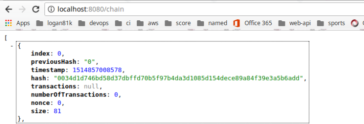
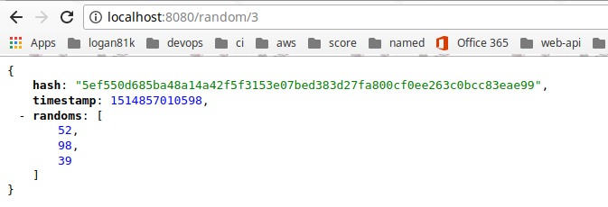
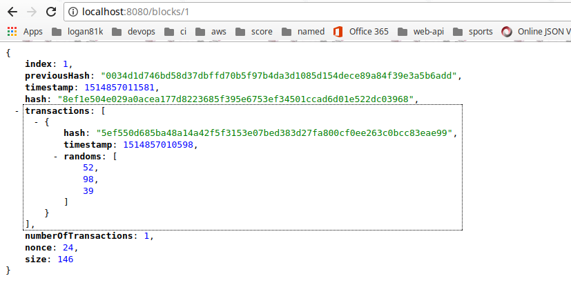
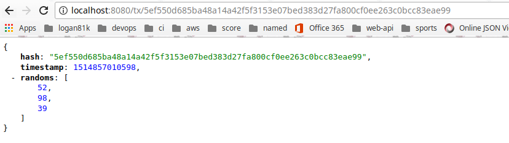
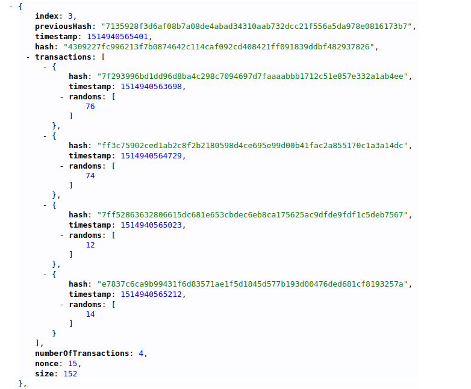

# Random number block chain

## 중요!!) 현재는 학습 목적이라 hash값 생성이나 기타 디테일한 부분은 흉내내기 수준으로 구현함.   

### Motivation

Block chain을 공부하기 위하여 가장 단순하고 간단하게 Block chain을 구현함.
P2P는 아직 구현하지 못함. 추후 업데이트 예정.


### How to work

```
1. 프로그램을 실행하면 miner가 채굴을 시작함. 
2. miner는 3초에 한번씩 Block을 생성하며 Transaction Pool에 Transaction이 있을 경우만 Transaction을 가져와 Block생성.
3. 사용자가 Random Number를 요청하는 request(http://localhost:8080/random/{limit})가 들어오면 
Transaction(random number)을 생성해서 Transaction Pool에 저장.
4. 하나의 Request는 하나의 Transaction이 된다.
5. request가 들어오는 시간을 기반으로 random number를 생성하여 random number에 대한 투명성을 높인다.
(아직 미구현. 중요한 부분은 아니어서 현재는 그냥 random number를 생성하도록 함)
```

### How to run

```
sh gradlew clean build -x test

java -jar build/libs/random-block-chain-x.x.x-SNAPSHOT.jar
```

### Get Chain 
##### BlockChain 조회하기 - http://localhost:8080/chain

참고) 프로그램을 실행하면 Genesis Block생성.



### Get Random number
##### Random Number 요청하기 - http://localhost:8080/random/{limit}

- limit수 만큼의 random number를 요청함.



 
### Get Block 
##### Block Number로 조회하기 - http://localhost:8080/blocks/{blockNumber} 




### Get Transaction 
##### Transaction Id로 조회하기 - http://localhost:8080/tx/{txId}




### Multi Request 

Miner는 3초에 한번씩 block을 생성하며, Transaction pool에 있는 모든 Transaction을 block에 저장하여 block을 생성한다. 


